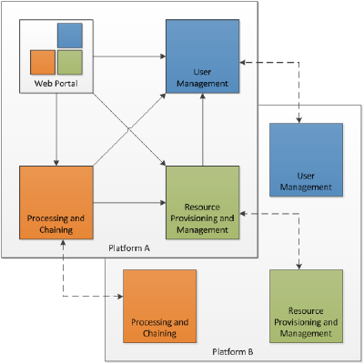

<!-- PROJECT SHIELDS -->
<!--
*** See the bottom of this document for the declaration of the reference variables
*** for contributors-url, forks-url, etc. This is an optional, concise syntax you may use.
*** https://www.markdownguide.org/basic-syntax/#reference-style-links
-->
[![Contributors][contributors-shield]][contributors-url]
[![Forks][forks-shield]][forks-url]
[![Stargazers][stars-shield]][stars-url]
[![Issues][issues-shield]][issues-url]
[![License][license-shield]][license-url]
[![Build][build-shield]][build-url]


<!-- PROJECT LOGO -->
<br />
<p align="center">
  <a href="https://github.com/EOEPCA/eoepca">
    
  </a>

  <h3 align="center">EOEPCA system</h3>

  <p align="center">
    EOEPCA Reference Implementation - System
    <br />
    <a href="https://github.com/EOEPCA/eoepca"><strong>Explore the docs »</strong></a>
    <br />
    <a href="https://github.com/EOEPCA/eoepca">View Demo</a>
    ·
    <a href="https://github.com/EOEPCA/eoepca/issues">Report Bug</a>
    ·
    <a href="https://github.com/EOEPCA/eoepca/issues">Request Feature</a>
  </p>
</p>


<!-- TABLE OF CONTENTS -->
## Table of Contents

- [Table of Contents](#table-of-contents)
- [About The Project](#about-the-project)
- [Getting Started](#getting-started)
  - [Hostnames and DNS](#hostnames-and-dns)
- [System Documentation](#system-documentation)
- [Technical Domains](#technical-domains)
  - [User Management](#user-management)
  - [Processing and Chaining](#processing-and-chaining)
  - [Resource Management](#resource-management)
- [Releases](#releases)
- [Issues](#issues)
- [License](#license)
- [Contact](#contact)
- [Acknowledgements](#acknowledgements)


<!-- ABOUT THE PROJECT -->
## About The Project

EO Exploitation Platform Common Architecture (EOEPCA)

The goal of the “Common Architecture” is to define and agree the technical interfaces for the future exploitation of Earth Observation data in a distributed environment. The Common Architecture will thus provide the interfaces to facilitate the federation of different EO resources into a “Network of EO Resources”. The “Common Architecture” will be defined using open interfaces that link the different Resource Servers (building blocks) so that a user can efficiently access and consume the disparate services of the “Network of EO Resources”.

This repository represents the system integration of the building blocks that comprise the **Reference Implementation** of the Common Architecture.

The system is designed for deployment to cloud infrastructure orchestrated by a Kubernetes cluster. We include here the automation required to provision, deploy and test the emerging EOEPCA system.

<!-- GETTING STARTED -->
## Getting Started

The EOEPCA system deployment comprises several steps. Instructions are provided for both cloud deployment, and local deployment for development purposes.

For the latest release (v0.9) ensure that the [correct version](https://github.com/EOEPCA/eoepca/blob/v0.9/README.md "v0.9 README") of this README is followed.

The first step is to fork this repository into your GitHub account. Use of fork (rather than clone) is recommended to support our GitOps approach to deployment with Flux Continuous Delivery, which requires write access to your git repository for deployment configurations.<br>
Having forked, clone the repository to your local platform...
```
$ git clone git@github.com:<user>/eoepca.git
$ cd eoepca
$ git checkout v0.9
```
NOTE that this clones the specific tag that is well tested. The `develop` branch should alternatively be used for the latest development.

Step | Cloud (OpenStack) | Local Developer
-----|-------------------|----------------
Infrastructure | [CREODIAS](./creodias/README.md) | n/a *(local developer platform)*
Kubernetes Cluster | [Rancher Kubernetes Engine](./kubernetes/README.md) | [Minikube](./minikube/README.md)
EOEPCA System Deployment | [EOEPCA GitOps](./system/clusters/README.md) | [EOEPCA GitOps](./system/clusters/README.md)
Acceptance Test | [Run Test Suite](./test/acceptance/README.md) | [Run Test Suite](./test/acceptance/README.md)

NOTE that, with release v0.9, the number of system components has been expanded to the point where it is more difficult to make a full system deployment in minikube, due to the required resource demands.

### Hostnames and DNS

To ease development/testing, the EOEPCA deployment is configured to use host/service names that embed IP-addresses - which avoids the need to configure public nameservers, (as would be necessary for a production deployment). Our services are exposed through Kubernetes ingress rules that use name-based routing, and so simple IP-addresses are insufficient. Therefore, we exploit the services of [nip.io](https://nip.io/) that provides dynamic DNS in which the hostname->IP-adress mapping is embedded in the hostname.

Thus, we use host/service names of the form `<service-name>.<public-ip>.nip.io`, where the `<public-ip>` is the public-facing IP-address of the deployment. For cloud deployment the public IP is that of the cloud load-balancer, or for minikube it is the `minikube ip` - for example `workspace.192.168.49.2.nip.io`.

NOTE that we also maintain a deployment under the domain `demo.eoepca.org` - upon which this release has been prepared.

Our public endpoint address is baked into our deployment configuration - in particular the Kubernetes Ingress resources. To re-use our deployment configuration these Ingress values must be updated to suit your deployment environment.

## System Documentation

* [Use Case Analysis Document](https://eoepca.github.io/use-case-analysis/)
* [Master System Design Document](https://eoepca.github.io/master-system-design/)
* [Master System ICD Document](https://eoepca.github.io/master-system-icd/)


## Technical Domains

### User Management

Building Block | Repository | Documentation
---------------|------------|--------------
Login Service | https://github.com/EOEPCA/um-login-service | https://eoepca.github.io/um-login-service/<br>https://github.com/EOEPCA/um-login-service/wiki
User Profile | https://github.com/EOEPCA/um-user-profile | https://eoepca.github.io/um-user-profile/<br>https://github.com/EOEPCA/um-user-profile/wiki
Policy Enforcement Point (PEP) | https://github.com/EOEPCA/um-pep-engine | https://eoepca.github.io/um-pep-engine/<br>https://github.com/EOEPCA/um-pep-engine/wiki
Policy Decision Point (PDP) | https://github.com/EOEPCA/um-pep-engine | https://eoepca.github.io/um-pep-engine/<br>https://github.com/EOEPCA/um-pdp-engine/wiki

### Processing and Chaining

Building Block | Repository | Documentation
---------------|------------|--------------
Application Deployment & Execution Service (ADES) | https://github.com/EOEPCA/proc-ades | https://eoepca.github.io/proc-ades/<br>https://github.com/EOEPCA/proc-ades/wiki
Processor Development Environment (PDE) | https://github.com/EOEPCA/proc-pde | https://github.com/EOEPCA/proc-pde/blob/master/README.md
Sample Application: s-expression | https://github.com/EOEPCA/app-s-expression | https://github.com/EOEPCA/app-s-expression/blob/main/README.md
Sample Application: nhi | https://github.com/EOEPCA/app-nhi | https://github.com/EOEPCA/app-nhi/blob/main/README.md

### Resource Management

Building Block | Repository | Documentation
---------------|------------|--------------
Resource Catalogue | https://github.com/geopython/pycsw | https://eoepca.github.io/rm-resource-catalogue/<br>https://docs.pycsw.org/en/latest/
Data Access Services | https://github.com/EOEPCA/rm-data-access/ | https://eoepca.github.io/rm-data-access/
User Workspace | https://github.com/EOEPCA/rm-workspace-api/ | https://eoepca.github.io/rm-workspace-api/


<!-- Releases -->
## Releases

EOEPCA system releases are made to provide integrated deployments of the developed building blocks. The release history is as follows:

* xx/07/2021 - [Release 0.9](https://github.com/EOEPCA/eoepca/blob/v0.9/release-notes/release-0.9.md)
* 10/03/2021 - [Release 0.3](https://github.com/EOEPCA/eoepca/blob/v0.3/release-notes/release-0.3.md)
* 23/11/2020 - [Release 0.2](release-notes/release-0.2.md)
* 13/08/2020 - [Release 0.1.2](release-notes/release-0.1.2.md)
* 06/08/2020 - [Release 0.1.1](release-notes/release-0.1.1.md)
* 22/06/2020 - [Release 0.1](release-notes/release-0.1.md)

<!-- ISSUES -->
## Issues

See the [open issues](https://github.com/EOEPCA/eoepca/issues) for a list of proposed features (and known issues).

<!-- LICENSE -->
## License

The EOEPCA SYSTEM is distributed under the European Space Agency - ESA Software Community Licence Permissive – v2.4. See `LICENSE` for more information.

Building-blocks and their sub-components are individually licensed. See their respective source repositories for details.


<!-- CONTACT -->
## Contact

Project Link: [Project Home (https://eoepca.github.io/)](https://eoepca.github.io/)


<!-- ACKNOWLEDGEMENTS -->
## Acknowledgements

* README.md is based on [this template](https://github.com/othneildrew/Best-README-Template) by [Othneil Drew](https://github.com/othneildrew).


<!-- MARKDOWN LINKS & IMAGES -->
<!-- https://www.markdownguide.org/basic-syntax/#reference-style-links -->
[contributors-shield]: https://img.shields.io/github/contributors/EOEPCA/eoepca.svg?style=flat-square
[contributors-url]: https://github.com/EOEPCA/eoepca/graphs/contributors
[forks-shield]: https://img.shields.io/github/forks/EOEPCA/eoepca.svg?style=flat-square
[forks-url]: https://github.com/EOEPCA/eoepca/network/members
[stars-shield]: https://img.shields.io/github/stars/EOEPCA/eoepca.svg?style=flat-square
[stars-url]: https://github.com/EOEPCA/eoepca/stargazers
[issues-shield]: https://img.shields.io/github/issues/EOEPCA/eoepca.svg?style=flat-square
[issues-url]: https://github.com/EOEPCA/eoepca/issues
[license-shield]: https://img.shields.io/github/license/EOEPCA/eoepca.svg?style=flat-square
[license-url]: https://github.com/EOEPCA/eoepca/blob/master/LICENSE
[build-shield]: https://www.travis-ci.com/EOEPCA/eoepca.svg?branch=master
[build-url]: https://travis-ci.com/github/EOEPCA/eoepca
[product-screenshot]: images/screenshot.png
