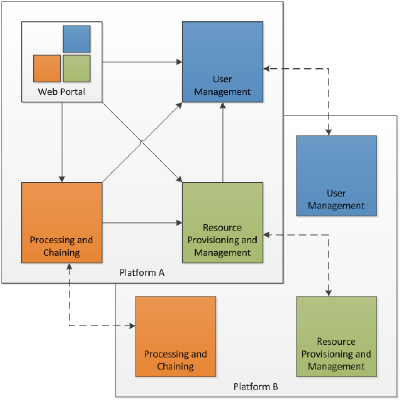

<!-- PROJECT SHIELDS -->
<!--
*** See the bottom of this document for the declaration of the reference variables
*** for contributors-url, forks-url, etc. This is an optional, concise syntax you may use.
*** https://www.markdownguide.org/basic-syntax/#reference-style-links
-->
[![Contributors][contributors-shield]][contributors-url]
[![Forks][forks-shield]][forks-url]
[![Stargazers][stars-shield]][stars-url]
[![Issues][issues-shield]][issues-url]
[![License][license-shield]][license-url]
[![Build][build-shield]][build-url]


<!-- PROJECT LOGO -->
<br />
<p align="center">
  <a href="https://github.com/EOEPCA/eoepca">
    
  </a>

  <h3 align="center">EOEPCA system</h3>

  <p align="center">
    EOEPCA Reference Implementation - System
    <br />
    <a href="https://github.com/EOEPCA/eoepca"><strong>Explore the docs »</strong></a>
    <br />
    <a href="https://github.com/EOEPCA/eoepca">View Demo</a>
    ·
    <a href="https://github.com/EOEPCA/eoepca/issues">Report Bug</a>
    ·
    <a href="https://github.com/EOEPCA/eoepca/issues">Request Feature</a>
  </p>
</p>


<!-- TABLE OF CONTENTS -->
## Table of Contents

- [Table of Contents](#table-of-contents)
- [About The Project](#about-the-project)
- [Getting Started](#getting-started)
  - [Hostnames and DNS](#hostnames-and-dns)
- [System Documentation](#system-documentation)
  - [Deployment Guide](#deployment-guide)
  - [Legacy Documentation](#legacy-documentation)
- [Building Blocks](#building-blocks)
- [Implemented Standards](#implemented-standards)
- [Releases](#releases)
- [Issues](#issues)
- [License](#license)
- [Contact](#contact)
- [Acknowledgements](#acknowledgements)


<!-- ABOUT THE PROJECT -->
## About The Project

EO Exploitation Platform Common Architecture (EOEPCA)

Earth Observation (EO) data has quickly evolved into an indispensable resource, directly facilitating solutions for society's most pressing challenges. This intensifying influx of data, oftentimes distributed across multiple independent platforms, presents a significant challenge for end-users in efficiently accessing and collaborating on critical geospatial tasks. Nevertheless, these platforms are more commonly collocated with cloud computing resources and applications such that users are now able to perform geospatial analysis tasks remotely. Working in the cloud bypasses traditional download, storage and performance limitations, however the distributed nature of these platform networks introduces complexities in the free and collective access to this remote geospatial data. 

Our vision with EOEPCA then is for greater interoperability between such platforms, towards an open network of resources, whilst enabling current and future users to easily collaborate on geospatial analysis tasks at source. To this end we are helping to establish a consensus of best practice for EO Exploitation Platforms, based on open standards. Supporting that, we are developing a reference implementation of building blocks, as free open source software.

The goal of the EOEPCA's “Common Architecture” is therefore to define and agree the technical interfaces for the future exploitation of Earth Observation data in a distributed environment. The Common Architecture will provide the interfaces to facilitate the federation of different EO resources into a “Network of EO Resources”. The “Common Architecture” will be defined using open interfaces that link the different Resource Servers (building blocks) so that a user can efficiently access and consume the disparate services of the “Network of EO Resources”.

This repository represents the system integration of the building blocks that comprise the **Reference Implementation** of the Common Architecture.

The system is designed for deployment to cloud infrastructure orchestrated by a Kubernetes cluster. We include here the automation required to provision, deploy and test the emerging EOEPCA system.

<!-- GETTING STARTED -->
## Getting Started

The EOEPCA system deployment comprises several steps. Instructions are provided for both cloud deployment, and local deployment for development purposes.

For the latest release (v1.4) ensure that the [correct version](https://github.com/EOEPCA/eoepca/blob/v1.4/README.md "v1.4 README") of this README is followed.

The first step is to fork this repository into your GitHub account. Use of fork (rather than clone) is recommended to support our GitOps approach to deployment with Flux Continuous Delivery, which requires write access to your git repository for deployment configurations.<br>
Having forked, clone the repository to your local platform...
```
$ git clone git@github.com:<user>/eoepca.git
$ cd eoepca
$ git checkout v1.4
```
NOTE that this clones the specific tag that is well tested. The `develop` branch should alternatively be used for the latest development.

Step | Cloud (OpenStack) | Local Developer
-----|-------------------|----------------
Infrastructure | [CREODIAS](./creodias/README.md) | n/a *(local developer platform)*
Kubernetes Cluster | [Rancher Kubernetes Engine](./kubernetes/README.md) | [Minikube](./minikube/README.md)
EOEPCA System Deployment<br>(`flux`) | [EOEPCA GitOps](./system/clusters/README.md) | [EOEPCA GitOps](./system/clusters/README.md)
EOEPCA System Deployment<br>([Deployment Guide](https://deployment-guide.docs.eoepca.org/)) | [Deployment Guide](https://deployment-guide.docs.eoepca.org/) | [Deployment Guide](https://deployment-guide.docs.eoepca.org/)
Acceptance Test | [Run Test Suite](./test/acceptance/README.md) | [Run Test Suite](./test/acceptance/README.md)

NOTE that, with release v1.4, the number of system components has been expanded to the point where it is more difficult to make a full system deployment in minikube, due to the required resource demands. Nevertheless, it is possible to make a minikube deployment to a single node with sufficient resources (8 cpu, 32GB) - as illustrated by the [Deployment Guide](https://deployment-guide.docs.eoepca.org/).

NOTE also that the [Deployment Guide](https://deployment-guide.docs.eoepca.org/) provides a more detailed description of the deployment and configuration of the components, supported by some shell scripts that deploy the components directly using `helm` (rather than using `flux` GitOps). The Deployment Guide represents a more informative introduction, and the supporting scripts assume `minikube` out-of-the-box.

### Hostnames and DNS

To ease development/testing, the EOEPCA deployment is configured to use host/service names that embed IP-addresses - which avoids the need to configure public nameservers, (as would be necessary for a production deployment). Our services are exposed through Kubernetes ingress rules that use name-based routing, and so simple IP-addresses are insufficient. Therefore, we exploit the services of [nip.io](https://nip.io/) that provides dynamic DNS in which the hostname->IP-adress mapping is embedded in the hostname.

Thus, we use host/service names of the form `<service-name>.<public-ip>.nip.io`, where the `<public-ip>` is the public-facing IP-address of the deployment (delimited with dashes `-`). For cloud deployment the public IP is that of the cloud load-balancer, or for minikube it is the `minikube ip` - for example `workspace.192-168-49-2.nip.io`.

_NOTE: `nip.io` supports either dots `.` or dashes `-` to delimit the IP-address in the DNS name. We use dashes, which seem to work better with LetsEncrypt rate limits._

> NOTES:<br>
> We also maintain deployments for development and test, under the domains `develop.eoepca.org` and `demo.eoepca.org`. 

Our public endpoint address is baked into our deployment configuration - in particular the Kubernetes Ingress resources. To re-use our deployment configuration these Ingress values must be updated to suit your deployment environment.

## System Documentation

### Deployment Guide

The [Deployment Guide](https://eoepca.readthedocs.io/projects/deploy/en/1.4/) provides the best system-level introduction to the system.

### Legacy Documentation

The following is the original documentation that was produced at the start of the project.<br>
It is included here for context...

* [Use Case Analysis Document](https://eoepca.github.io/use-case-analysis/)
* [Master System Design Document](https://eoepca.github.io/master-system-design/)


## Building Blocks

The following provides links to the resources for each building block - including documentaiton and source repositories...

* [**ADES - ZOO-Project DRU (Application Deployment & Execution Service)**](https://github.com/ZOO-Project/ZOO-Project) - [[repository]](https://github.com/ZOO-Project/ZOO-Project) [[docs]](https://www.zoo-project.org/new/Resources/Documentation):
  * [**Helm chart**](https://github.com/ZOO-Project/charts/tree/main/zoo-project-dru)
  * [**eoepca-proc-service-template**](https://github.com/EOEPCA/eoepca-proc-service-template) - Cookie-cutter template for Application Package execution in Kubernetes
  * [**zoo-calrissian-runner**](https://github.com/EOEPCA/zoo-calrissian-runner) - Python library used by the `eoepca-proc-service-template` to aid orchestration of CWL application packages running in Kubernetes via Calrissian
  * [**pycalrissian**](https://github.com/terradue/pycalrissian) - Python library used by `zoo-calrissian-runner` to aid interfacing with Calrissian and Kubernetes
* [**Application Hub**](https://github.com/EOEPCA/application-hub-chart) - [[repository]](https://github.com/EOEPCA/application-hub-context) [[docs]](https://eoepca.github.io/application-hub-context/):
  * **ApplicationHub Applications:**
    * **Processor Development Environment** [[repository]](https://github.com/EOEPCA/pde-code-server)
    * **JupyterLab** [[repository]](https://github.com/EOEPCA/iat-jupyterlab)
    * **Remote Desktop** [[repository]](https://github.com/EOEPCA/iga-remote-desktop)
    * **Remote Desktop with QGIS** [[repository]](https://github.com/EOEPCA/iga-remote-desktop-qgis)
    * **Remote Desktop with SNAP** [[repository]](https://github.com/EOEPCA/iga-remote-desktop-snap)
    * **Dashboard with Streamlit** [[repository]](https://github.com/EOEPCA/iga-streamlit-demo)
* [**Resource Catalogue**](https://github.com/EOEPCA/rm-resource-catalogue) - [[repository]](https://github.com/geopython/pycsw) - [[docs]](https://github.com/EOEPCA/rm-resource-catalogue)
* [**Data Access**](https://github.com/EOEPCA/rm-data-access/) - [[repository]](https://gitlab.eox.at/vs/vs) - [[docs]](https://github.com/EOEPCA/rm-data-access/)
* [**Registration API**](https://github.com/EOEPCA/rm-registration-api) - [[repository]](https://github.com/EOEPCA/rm-registration-api) - [[docs]](https://github.com/EOEPCA/rm-registration-api/wiki)
* [**Workspace API**](https://github.com/EOEPCA/rm-workspace-api/) - [[repository]](https://github.com/EOEPCA/rm-workspace-api) - [[docs]](https://github.com/EOEPCA/rm-workspace-api/wiki)
* [**Minio Bucket API**](https://github.com/EOEPCA/rm-minio-bucket-api) - [repository](https://github.com/EOEPCA/rm-minio-bucket-api) - [docs](https://github.com/EOEPCA/rm-minio-bucket-api#readme)
* **Identity & Access Management...**
  * **Keycloak Solution (NEW)**
    * [**Identity Service**](https://github.com/EOEPCA/um-identity-service) - [[repository]](https://github.com/EOEPCA/um-identity-service) - [[docs]](https://deployment-guide.docs.eoepca.org/v1.4/eoepca/identity-service/) - [[keycloak]](https://www.keycloak.org/documentation)
    * [**Identity API**](https://github.com/EOEPCA/um-identity-api) - [[repository]](https://github.com/EOEPCA/um-identity-api) - [[docs]](https://deployment-guide.docs.eoepca.org/v1.4/eoepca/identity-service/)
    * [**Identity Gatekeeper**](https://github.com/gogatekeeper/gatekeeper) - [[repository]](https://github.com/gogatekeeper/gatekeeper) - [[docs]](https://deployment-guide.docs.eoepca.org/v1.4/eoepca/resource-protection-keycloak/) - [[gogatekeeper]](https://gogatekeeper.github.io/gatekeeper/userguide/)
  * **Gluu Solution (deprecated)**
    * [**Login Service**](https://github.com/EOEPCA/um-login-service) - [[repository]](https://github.com/EOEPCA/um-login-service) - [[docs]](https://github.com/EOEPCA/um-login-service/wiki) - [[gluu]](https://gluu.org/docs/gluu-server/4.1/)
    * [**Resource Protection**](https://system-description.docs.eoepca.org/current/iam/resource-guard/) - [[repository]](https://github.com/EOEPCA/helm-charts/tree/main/charts/resource-guard) - [[docs]](https://github.com/EOEPCA/helm-charts/tree/main/charts/resource-guard#readme)
    * [**Policy Decision Point**](https://github.com/EOEPCA/um-pdp-engine) - [[repository]](https://github.com/EOEPCA/um-pdp-engine) - [[docs]](https://github.com/EOEPCA/um-pdp-engine/wiki)
    * [**User Profile**](https://github.com/EOEPCA/um-user-profile) - [[repository]](https://github.com/EOEPCA/um-user-profile) - [[docs]](https://github.com/EOEPCA/um-user-profile/wiki)


<!-- Implemented-Standards -->
## Implemented Standards

The EOEPCA project aligns with OGC standards and best practices including:

- OGC API: Coverages, Maps, Records, Features, Processing, Tiles
- OGC Web Services: WFS, WMTS, WCS, WMS, WPS

For full documentation on how EOEPCA implements these standards, visit the [EOEPCA](https://github.com/EOEPCA) repository. For further details on the OGC standards visit the official [API](https://ogcapi.ogc.org/) and [Web Services](https://www.ogc.org/standard/owc/) pages.

<!-- Releases -->
## Releases

EOEPCA system releases are made to provide integrated deployments of the developed building blocks. The release history is as follows:

| Date | Release |
| :---: | :---: |
| 28/02/2024 | [Release 1.4](https://github.com/EOEPCA/eoepca/releases/tag/v1.4) |
| 25/09/2023 | [Release 1.3](https://github.com/EOEPCA/eoepca/releases/tag/v1.3) |
| 20/12/2022 | [Release 1.2](https://github.com/EOEPCA/eoepca/blob/v1.2/release-notes/release-1.2.md) |
| 31/05/2022 | [Release 1.1](https://github.com/EOEPCA/eoepca/blob/v1.1/release-notes/release-1.1.md) |
| 24/12/2021 | [Release 1.0](https://github.com/EOEPCA/eoepca/blob/v1.0/release-notes/release-1.0.md) |
| 23/07/2021 | [Release 0.9](https://github.com/EOEPCA/eoepca/blob/v0.9/release-notes/release-0.9.md) |
| 10/03/2021 | [Release 0.3](https://github.com/EOEPCA/eoepca/blob/v0.3/release-notes/release-0.3.md) |
| 23/11/2020 | [Release 0.2](release-notes/release-0.2.md) |
| 13/08/2020 | [Release 0.1.2](release-notes/release-0.1.2.md) |
| 06/08/2020 | [Release 0.1.1](release-notes/release-0.1.1.md) |
| 22/06/2020 | [Release 0.1](release-notes/release-0.1.md) |

<!-- ISSUES -->
## Issues

See the [open issues](https://github.com/EOEPCA/eoepca/issues) for a list of proposed features (and known issues).

<!-- LICENSE -->
## License

The EOEPCA SYSTEM is distributed under the OSI approved Apache 2.0 Licence. See [`LICENSE`](https://github.com/EOEPCA/eoepca/blob/v1.4/LICENSE) for more information.

Building-blocks and their sub-components are individually licensed. See their respective source repositories for details.


<!-- CONTACT -->
## Contact

Project Link: [Project Home (https://eoepca.org/)](https://eoepca.org/)


<!-- ACKNOWLEDGEMENTS -->
## Acknowledgements

* README.md is based on [this template](https://github.com/othneildrew/Best-README-Template) by [Othneil Drew](https://github.com/othneildrew).


<!-- MARKDOWN LINKS & IMAGES -->
<!-- https://www.markdownguide.org/basic-syntax/#reference-style-links -->
[contributors-shield]: https://img.shields.io/github/contributors/EOEPCA/eoepca.svg?style=flat-square
[contributors-url]: https://github.com/EOEPCA/eoepca/graphs/contributors
[forks-shield]: https://img.shields.io/github/forks/EOEPCA/eoepca.svg?style=flat-square
[forks-url]: https://github.com/EOEPCA/eoepca/network/members
[stars-shield]: https://img.shields.io/github/stars/EOEPCA/eoepca.svg?style=flat-square
[stars-url]: https://github.com/EOEPCA/eoepca/stargazers
[issues-shield]: https://img.shields.io/github/issues/EOEPCA/eoepca.svg?style=flat-square
[issues-url]: https://github.com/EOEPCA/eoepca/issues
[license-shield]: https://img.shields.io/github/license/EOEPCA/eoepca.svg?style=flat-square
[license-url]: https://github.com/EOEPCA/eoepca/blob/master/LICENSE
[build-shield]: https://www.travis-ci.com/EOEPCA/eoepca.svg?branch=master
[build-url]: https://travis-ci.com/github/EOEPCA/eoepca
[product-screenshot]: images/screenshot.png
