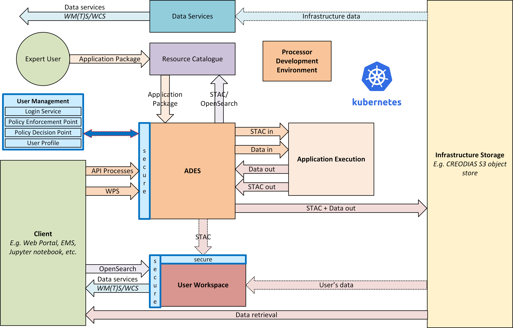

= ESA's EO Common Architecture v0.9
:toc: macro

On 24th December 2021 we released v1.0.0 of our EO Exploitation Platform Common Architecture (EOEPCA). Here we provide some additional context and a technical overview.

toc::[]

== Common Architecture Approach

The Common Architecture exists within the context of the ecosystem of platforms, data sources and cloud services that represent a Network of EO Resources. In order to fully exploit the potential of these complementary resources we anticipate the need to encourage interoperation amongst the platforms, such that users of one platform may consume the services of another directly platform-to-platform.

Thus, the goal of the Common Architecture is to define and agree a re-usable exploitation platform architecture using open interfaces to encourage interoperation and federation within this Network of Resources.

Interoperability through open standards is a key guiding force for the Common Architecture:
* Platform developers are more likely to invest their efforts in standard implementations that have wide usage
* Off the shelf solutions are more likely to be found for standards-based solutions

Our starting point is the Use Case analysis that considers the exploitation platform from the perspective of various users, including Experts who perform analysis and create added-value resources, Consumers of those resources, and Platform Providers that provision and operate the platform.

.*Common Architecture Approach*

Heavily informed by the outcomes of OGC Innovation Program activities, and taking account of existing platform approaches and industry best practise - we have derived an architecture to meet the use cases that is defined by components as building blocks with well defined service interfaces based upon open standards.

During the last year we have been developing a Reference Implementation to help refine the architecture and to provide re-usable building blocks. Our developments are all open source and available publicly on GitHub. We have just released v0.9 of the reference implementation - which is a beta release that provides a minimum viable set of integrated building blocks.

We are also working with Operators whose role is to integrate the emerging reference implementation into their respective operational platforms, and so provide feedback from a platform provider and end-user perspective.

== Beta Release v0.9

Release 0.9 targets system deployment to a Kubernetes cluster using a DevOps continuous integration/delivery approach. Each building block is released as a Docker container with supporting helm chart for Kubernetes deployment. Kubernetes provides an infrastructure-agnostic target for the deployment of our reference system components.

The release 0.9 system allows the execution of an end-to-end scenario in which a user can:

* Develop a containerised application using the Processor Development * Environment
* Register and login to the platform
* Deploy their application to their Workspace
* Access a secured ADES to deploy their application and execute bespoke processing
* Discover data in the resource catalogue to reference input data
* Initiate processing execution with outputs staged-out to S3 object store
* Output data is registered in their Workspace - available through its catalogue & data access services

.*v0.9 Reference Implementation*

At the heart of the system is the ADES which provides WPS and draft API Processes interfaces - including the Transaction extension for user deploy and execute of custom processes. The Application Package describes the containerised processing application, and can be pushed to a Resource Catalogue for discovery, and from where it can be deployed to an ADES instance.

Data is discovered through the Resource Catalogue, which provides OGC CSW. API Records (OAPIR) and OpenSearch interfaces. Input data to processing jobs is expressed using OpenSearch URLs. Data Services provide standards-based access to both platform and user-owned data. For our development system these components are integrated with the CREODIAS OpenStack offering and the EO data offering.

The ADES abstracts the interface between the user's application and the platform, by staging-in the data inputs and staging-out the processing results on behalf of the application. The abstraction relies upon use of STAC files as manifests for the data in each direction.

The ADES stages out the result-set to their personal S3 bucket that is provisioned by their User Workspace.  The User Workspace is responsible for provisioning user-specific buckets, the details of which are made available at runtime to the ADES for a user-centred stage-out. The processing cycle completes with the ADES registering the output results with the User Workspace API by reference to a STAC file that describes the products. Using this, the Workspace maintains user-specific Catalogue and Data Access endpoints which allow the user to further exploit their added-value products.

For platforms to successfully interoperate they must federate user access in order for requests between services to respect the user's authorization scope and to account for their actions. The ADES is secured by means of our Identity and Access Management framework, which uses OpenID Connect and User Managed Access standards to enforce all access attempts to the ADES in accordance with configured policy rules. Users authenticate through an external identity provider - GitHub and ESA's Commercial Operator Identity Hub are currently supported, with more to follow. During operation, the ADES configures the policy enforcement through a Resource API in order to protect dynamic endpoints, such as those created when a new application is deployed, or when a new processing job is initiated.

== Application Deployment and Execution Service (ADES)

At the heart of the exploitation platform is the ability of the expert user to deploy and execute their own algorithms within the platform, close to the data. Expert users encapsulate their application as a Docker container, and we have embraced the Common Workflow Language to describe its inputs, outputs and invocation profile.

The ADES is built-upon the Zoo-project WPS server which provides WPS 1.0, 2.0 and draft API Processes interfaces, including support for custom application deployment through the Transaction extension. The ADES uses the Calrissian workflow engine which provides a Kubernetes native CWL runner, in which each job is executed in its own Kubernetes namespace.

.*Application Deployment and Execution Service (ADES)*

The highlighted interfaces are those for DEPLOY and EXECUTE. For EXECUTE we follow the JSON bindings described by the draft API Processes specification. For the DEPLOY operation, for which there is no specific body format defined, we re-use that of the EXECUTE request. The DEPLOY operation is treated as an execute request of a `DeployProcess` operation, with the application package being provided as an input to this execute request. A similar approach is taken for the UNDEPLOY operation.

The Application Package is specified as a standard CWL Workflow. The DEPLOY operation expects to receive the application package either as an atom feed entry containing an OGC OWS Content Offering, or as a direct reference to the CWL.

In order to provide a generic ADES implementation that is platform independent, the stage-in and stage-out functions are separated to provide a pluggable abstraction. At deployment time the ADES is configured with CWL that defines the stage-in and stage-out functionality. In each case a CWL CommandLineTool is defined, typically using a docker container to implement these platform-specific functions. These CWL implement the interface with the application using STAC manifests to describe the input data and to receive the output data. Thus, the ADES acts as a data access broker, to simplify applications needing complex logic for multiple data access protocols and file formats.

== Processor Development Environment (PDE)

The Processor Development Environment runs as a standalone VM providing a core toolset to support the development, test and packaging of processing applications - in an environment that seeks to replicate the conditions an application experiences when running in the ADES on a platform. All of this is exposed through an integrated web interface.

.*Processor Development Environment (PDE)*
image::pde-overview.png[width=70%,pdfwidth=70%,align="center"]

MinIO S3 object store allows provisioning of EO data to support development and testing.

A JupyterLab instance facilitates experimenting and prototyping against the local EO data.

The Theia IDE provides a web-based Visual Studio Code editor for development of the processing application, with integrated git client for source control.

The PDE integrates the tooling required to test the application and its packaging in an ADES-like environment, with CWL workflow execution and stage-out of results to S3 storage.

The integrated Jenkins provides continuous build and packaging of the processing application, with the resultant container pushed to a docker registry, for example Docker Hub.

The final developer step is to push their application package to the Resource Catalogue to publish their application.

At the moment the PDE is a self contained virtual machine. The next step is to integrate the PDE more fully into our system deployment.

.*PDE - Landing Page*
image::pde-landing-page.png[width=85%,pdfwidth=85%,align="center"]

.*PDE - JupyterLab*
image::pde-jupyter.png[width=85%,pdfwidth=85%,align="center"]

.*PDE - Theia Integrated Development Environment (IDE)*

== Resource Management

=== Resource Catalogue (pycsw)

For the Resource Catalogue we are using pycsw for data, and also for processing resources. pycsw has been enhanced by the project team to improve the OpenSearch support with the geo, time & eo extensions, and to add support for OGC API Records.

* OGC CSW 3.0.0 and 2.0.2 interfaces
* OGC OpenSearch Geo/Time/EO Extensions
* OGC API Records
* Metadata: ISO-19115-1/2
* Federated catalogue distributed searching

All these updates are contributed directly to the upstream development.

=== Data Access Services (EOxServer)

Data Access is provided through EOxServer, providing various OGC interfaces for data access and data visualisation.

* OGC WMS 1.1 - 1.3 interfaces
* OGC WMTS 1.0 interfaces with automatic caching
* OGC WCS 2.0 interfaces with EO Application Profile

=== Interoperable Data Principles

Data is naturally heterogeneous between different data sources, communities and platforms. So we must also consider interoperability of data in addition to platform services…

* OpenSearch links for data (input/output) references +
Data (input/output) is referenced consistently through OpenSearch links, which provides machine-readable metadata to facilitate data handling.

* ADES stage-in/out 'adaptor' +
ADES stage-in/out provides an adapter between the source, the platform and the end-user application. Platform providers can 'plugin' custom implementations.

* Minimise 'data in motion' - cloud optimised data formats +
Ideally, the application can consume the data directly, which is important to gain the benefit of cloud optimised data formats.

* Data abstraction services, e.g. WCS, EDR, DAPA +
Use of data access services such as WCS, in which the raw data files/formats are abstract from the data access interface, is encouraged to improve application portability

=== Workspace

The Workspace is responsible to coordinate a user's resources within the platform. In doing so it provides an abstraction of the underlying infrastructure. The Workspace provisions storage within the underlying infrastructure, typically buckets, on behalf of the user. Components needing access to this user storage, such as the ADES staging out processing results, interrogate the Workspace to obtain details of the storage.

.*Workspace API*

Similarly the Workspace provides an interface through which stored data can be registered by supplying a STAC manifest - thus allowing the Workspace to establish the data in the user's catalogue. The Workspace provides user-specific endpoints for Resource Catalogue and Data Access services which facilitates the use of user resources in processing workflows.

== Identity and Access Management (IAM)

The platform services must operate within the context of a user authorisation model, in which resources are owned, and access to resources is protected and accounted for.

We advocate a common approach by defining platform services for Identity and Access Management, that support Resource Servers to consistently participate in this common authorisation approach. The design is intended to facilitate the federation of service-to-service interfaces across platform boundaries.

* Resource protection as-a-service
* Platform APIs to aid Resource Servers
* Unburden Resource Servers from authorisation model implementation

.*Identity and Access Management (IAM)*

=== User Authentication

Users authenticate with the platform using OpenID Connect - the actual authentication being deferred to external providers, such as GitHub. The outcome is an ID Token (JWT) that captures their successful login and represents their unique identity.

=== Authorisation

Authorisation is enforced through User Managed Access (UMA), in which the user's ID Token is leveraged to establish a Relying Party Token (RPT). The RPT is a short-lived credential that encapsulates the authorisation of a client to make a scoped access to a resource on behalf of a particular user.

UMA allows Resource Owners to retain governance over their resources while providing a centralised unified approach for authorisation. The PDP exposes a XACML endpoint for policy checks.

The approach is designed to support identity and access federation across platform boundaries.

=== IAM APIs

The architecture defines two APIs to support resource servers in the protection of resources on behalf of their owners:

* Resource API, through which new resources are registered for protection. In particular this allows resource servers to dynamically register resources as they are created within the platform. For example, a newly deployed application, or a job status endpoint that is created when a user executes a process.
* Policy API, through which policy rules are associated to resources. Through this, default owner-only rules can be applied to a new resource, and management interfaces can exploit the Policy API to configure additional policies, such as sharing.

== Upcoming Features

Following this release v0.9, the focus of our current develops to feature in our next release includes:

* Protection of user's owned resources in their Workspace
* Application deployment (ADES) from Workspace managed Application Package
* User Processing History linked to processing results
* Mundi deployment / integration
