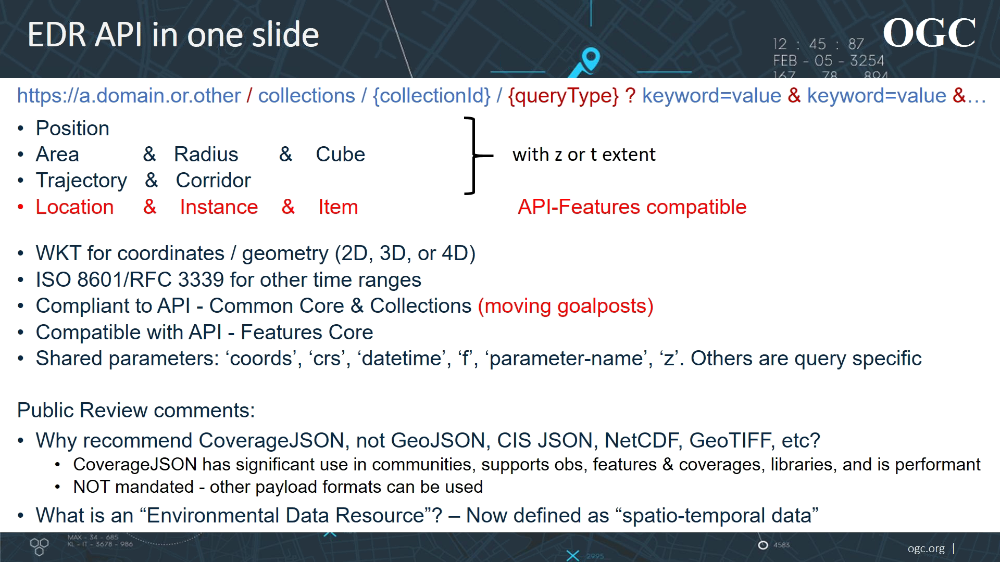

# DAPA

Alternative DAPA approaches.

## DAPA #1 (Interactive Instruments / Terradue)

Paths based upon of the **type of the operation**...

* GET /collections/{collection}/processes 
  _list the available data retrieval patterns_
* GET /collections/{collection}/variables 
  _fetch the observable properties included in this
observation collection_
* GET /collections/{collection}/processes/area:aggregate-space 
  _retrieve a time series for selected variables for each station in an area and apply functions on the values of each time step_
* GET /collections/{collection}/processes/area:aggregate-space-time 
  _retrieve a time series for selected variables for each station in an area and apply functions on all values_
* GET /collections/{collection}/processes/area:aggregate-time 
  _retrieve a time series for selected variables for each station in an area and apply functions on the values of each time series_
* GET /collections/{collection}/processes/area:retrieve 
  _retrieve a time series for selected variables for each station in an area_
* GET /collections/{collection}/processes/grid:aggregate-time 
  _retrieve a time series for selected variables for each station in an area, resample the observations to a time series in a 2D grid and apply functions on the values of each time series_
* GET /collections/{collection}/processes/grid:retrieve 
  _retrieve a time series for selected variables for each station in an area and resample the observations to a time series for each cell in a 2D grid_
* GET /collections/{collection}/processes/position:aggregate-time 
  _retrieve a time series for selected variables at a position_
* GET /collections/{collection}/processes/position:retrieve 
  _retrieve a time series for selected variables at a position_

## DAPA #2 (EOX/DLR)

Paths based upon of the **type of the resultset**...

* /{collection}/dapa/fields 
  _Output fields/variables/properties/bands to be included in the request/processing/aggregation_
* /{collection}/dapa/cube 
  _2d raster time-series (each with one or multiple bands)_
* /{collection}/dapa/area 
  _Single 2d raster, aggregated over time_
* /{collection}/dapa/timeseries
  * /{collection}/dapa/timeseries/area 
    _1d time-series, aggregated over space_
  * /{collection}/dapa/timeseries/position 
    _Extraction of a time series at a point specified in the request_
* /{collection}/dapa/value
  * /{collection}/dapa/value/area 
    _Single value, aggregated over space and time_
  * /{collection}/dapa/value/position 
    _Single value_

# EDR

From OGC Developer Track (March 2021)...

