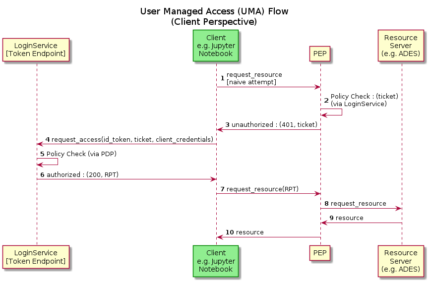

# User Management

## Ingress

| Ingress Name | URL | Backend |
| ------------ | --- | ------- |
| gluu-ingress-pdp-engine | test.demo.eoepca.org/pdp | pdp-engine:5567 |
| gluu-ingress-user-profile | test.demo.eoepca.org/web_ui | user-profile:5566 |
| gluu-ingress-user-profile-static | test.demo.eoepca.org/static | user-profile:5566 |
| um-login-service-nginx-base | test.demo.eoepca.org/ | oxtrust:8080 |
| um-login-service-nginx-gluu | test.demo.eoepca.org/oxauth | oxauth:8080 |
| um-login-service-nginx-openid-config | test.demo.eoepca.org/.well-known/openid-configuration | oxauth:8080 |
| um-login-service-nginx-scim-config | test.demo.eoepca.org/.well-known/scim-configuration | oxtrust:8080 |
| um-login-service-nginx-stateful | test.demo.eoepca.org/identity test.demo.eoepca.org/idp test.demo.eoepca.org/passport | oxtrust:8080 oxshibboleth:8080 oxpassport:8090 |
| um-login-service-nginx-u2f-config | test.demo.eoepca.org/.well-known/fido-u2f-configuration | oxauth:8080 |
| um-login-service-nginx-uma2-config | test.demo.eoepca.org/.well-known/uma2-configuration | oxauth:8080 |
| um-login-service-nginx-webdiscovery | test.demo.eoepca.org/.well-known/simple-web-discovery | oxauth:8080 |
| um-login-service-nginx-webfinger | test.demo.eoepca.org/.well-known/webfinger | oxauth:8080 |

## UMA Flow

