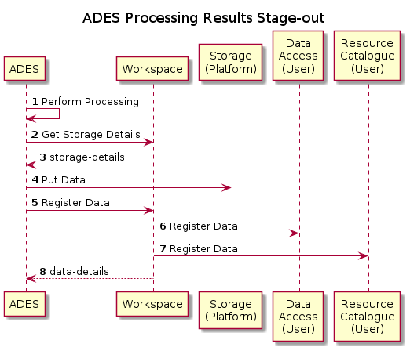
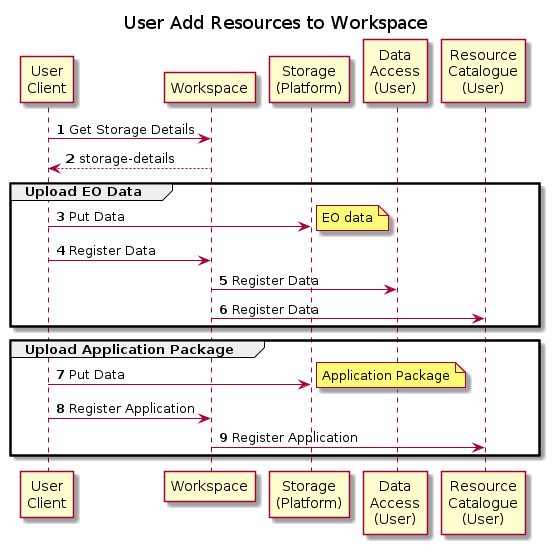
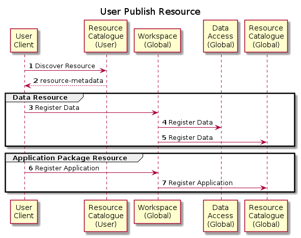

# Workspace

The Workspace collects and manages resources through Resource Catalogue and Data Access services. Typical resources include EO Data and Application Packages for processing applications.

Resources are provided at platform-level or owned by individual platform users. Thus, in the platform context, there are two types of Workspace:
* **Global Workspace** 
  Represents the global (platform-wide) resources that are 'owned' by the platform and available to all users. The Global Workspace is configured at platform deployment, and is represented by the platform Resource Catalogue and Data Access Services.
* **User Workspace** 
  Represents the resources that are 'owned' by individual platforms users - one User Workspace is provisioned per user, on demand.

The following sections provide interaction sequences between the Workspace and other platform components. In many cases the flow is equally applicable to the Global Workspace as the User Workspace - the difference being the scope of the resource ownership. In the case of the Global Workspace the 'user' is the platform operator.

## ADES Processing Results Stage-out

The ADES stages-out processing results by pushing them into the user's storage area and then calling the Workspace to register the data which is indexed by a STAC file manifest...

The ADES calls the Workspace to obtain details of the user's storage endpoint, which is used to push the resultset into the storage. The ADES then invokes the Workspace endpoint to trigger the registration of the data in the user's catalogue and (presumably) also to trigger the ingestion of the data into the user's data access services.

## User Add Resources to Workspace

The user (via a client) uploads data, which can be EO data (e.g. to be used as a processing input), or an application package to be used for processing.

Note that the same flow is applicable to the platform operator maintaining the resource provision of the _Global_ Resource Catalogue and Data Access services.

The User Client could be, for example, the interactive Web Portal provided by the platform.

The EO Data case is the same flow as for the ADES staging-out processing results.

The Application Package case, first performs an upload (similar to the EO Data case), and then invokes a Workspce endpoint to trigger the registration of the application package in the user's catalgue.

## User Publish Resource

In order to publish a resource from their Workspace, a user must register the resource to the Glocal Workspace, in the same way as was done for their User Workspace. In this scenario the resource is already committed to the platform storage, and so only the registration step is required.

In the above sequence it should be noted that resource protection is not considered, including:
* authorization protection of user access to the global workspace
* subsequent protection of the published resource
