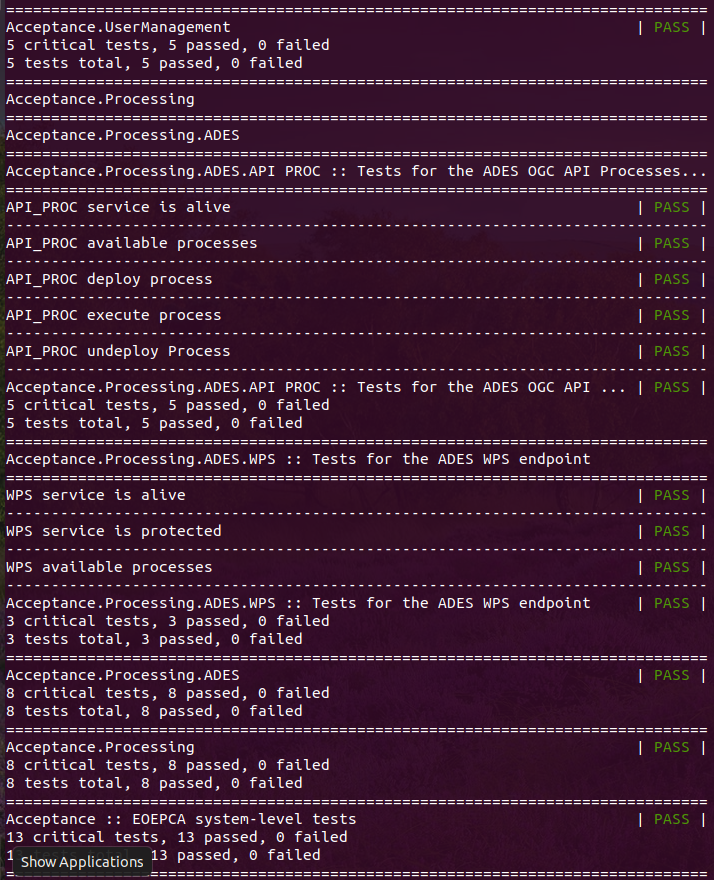

# EOEPCA Acceptance Test

This directory contains files to run the automated Acceptance Test of the EOEPCA system.

## Helper Scripts

These instructions reference some helper scripts, some of which rely upon the 'jq' tool ([command-line JSON processor](https://stedolan.github.io/jq/)). Therefore, to use these scripts it is necessary to ensure `jq` is installed on your local platform. It is available for installation via the package repositories for most popukar linux distrutions - see the [jq website](https://stedolan.github.io/jq/) for more details.

## Robot Framework

The acceptance tests use [Robot Framework](https://robotframework.org/), which must be installed before initiating the test suite. The installation instruction for Robot Framework [can be viewed here](https://github.com/robotframework/robotframework/blob/master/INSTALL.rst).

Robot Framework is supported by many libraries that extend its functionality, which must also be installed.

In order to ensure that robot framework and its dependencies are well installed, our acceptance test script establishes a python virtual environemnt in which robot and all required packages are installed. Thus, the main requirement is to ensure that you have the python virtualenv package installed on your system.

## Python Virtualenv

As described above, a [python virtualenv](https://docs.python.org/3/tutorial/venv.html) is used to established the testing environment. Thus it must be ensured that this package is localled installed, e.g. (ubuntu) `apt install python3-venv`.

## Run Acceptance Test

The acceptance test is invoked via the following script...
```
$ ./acceptance_tests.sh
```

At the conclusion of a successful run of the acceptance tests, the summary status is shown in the console window...



## Test Results

The test results can be visualised in the [output log file](./log.html), as follows...
```
$ xdg-open log.html
```
